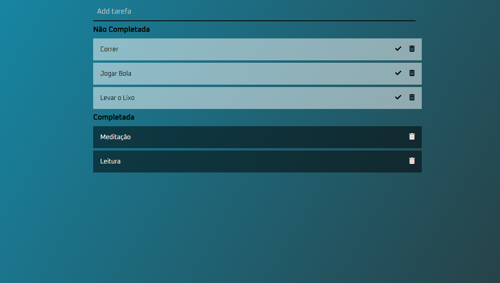

# To-do-List

<h1>
    
</h1>

## 🚀 Sobre

O projeto **To-Do-List** foi criado com o objetivo de ajudar a listar tarefas do cotidiano. Podem ser hábitos, ou compromissos também, ou até mesmo pode-se utilizar como um check-list.

---

## 💻 Tecnologias utilizadas

- HTML5 
- CSS3 
- Javascript 

---
🔥 Desenvolvido por **Diego Henrique**

